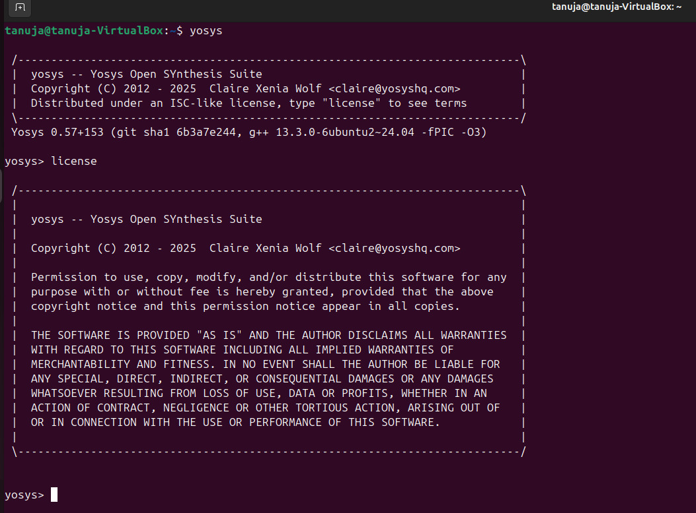
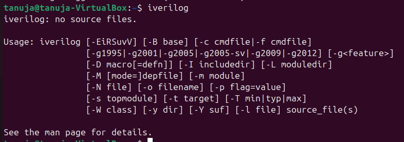
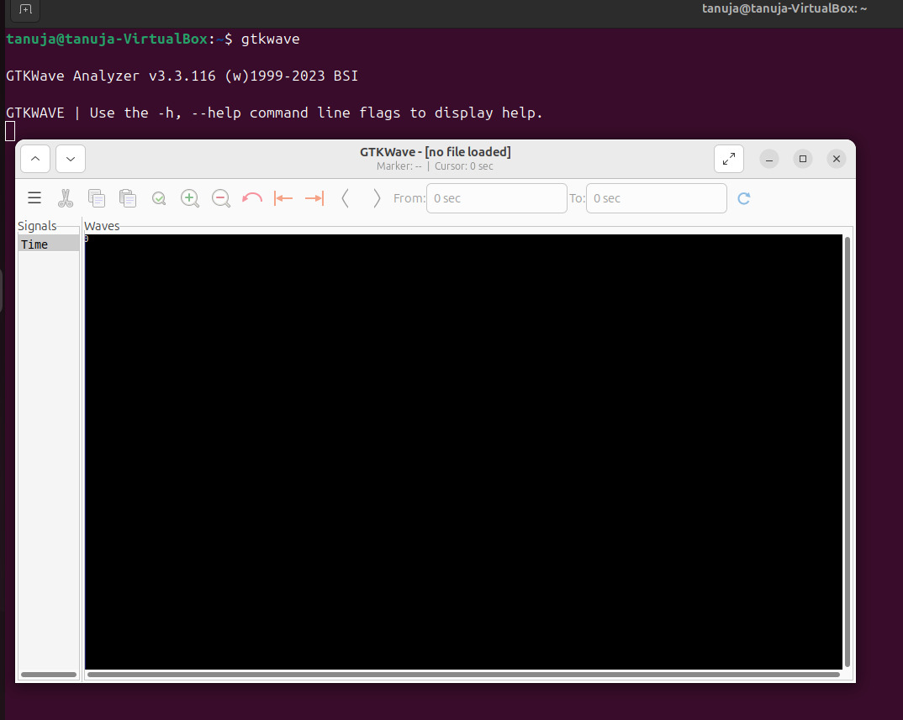

# 🚀 RISC-V_SOC_TASK_2
## 📌 Day 0 Overview
### The task of **Day 0** includes the installing the essential tools required for the **RISC V SOC Programme**.
### All tools are installed on *Ubuntu 24.04.3* (latest) running on *Oracle Virtual Machine 7.2.2*
---
## 🖥️ Ubuntu VirtualMachine
- **Version** --> 24.04.3
- **RAM** --> 10 GB
- **HDD** --> 50 GB
- **CPU** --> 4
---
  
## 🔧 Tools installed:

### Yosys
```bash
$ sudo apt-get update
$ git clone https://github.com/YosysHQ/yosys.git
$ cd yosys
$ sudo apt install make              
$ sudo apt-get install build-essential clang bison flex \ libreadline-dev gawk tcl-dev libffi-dev git \ graphviz xdot pkg-config python3 libboost-system-dev \ libboost-python-dev libboost-filesystem-dev zlib1g-dev
$ make config-gcc
$ git submodule update --init --recursive
$ make 
$ sudo make install
```
#### ✅ Yosys Successfully installed!

---
### Iverilog
```bash
$ sudo apt-get update
$ sudo apt-get install iverilog
```
#### ✅ Iverilog Successfully installed!

---
### GTKWave
```bash
$ sudo apt-get update
$ sudo apt install gtkwave
```
#### ✅ GTKWave Successfully installed!

---

# 🎯 Conclusion
## Day 0 focused on setting up the development environment by installing three key tools: 
- Yosys for synthesis, 
- Icarus Verilog for simulation, 
- GTKWave for waveform analysis. 

With the environment set up, we are now ready to move on to Day 1 tasks. These will involve writing, simulating, and analyzing Verilog designs.
